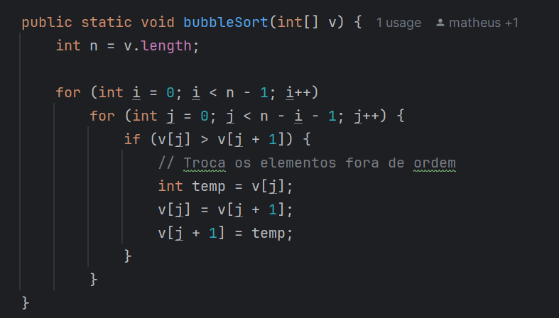
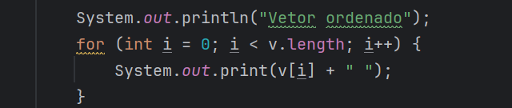

#  Ordenação com Bubble Sort em Java

Este documento detalha todos os passos e o funcionamento do código em Java que utiliza o algoritmo *Bubble Sort*. O programa permite ao usuário definir o tamanho de um array, preenche o array com números aleatórios, ordena-os e exibe o resultado.

---

### *Entrada do Usuário*

- O programa solicita ao usuário o tamanho do array.
- Um array de inteiros (v) é criado com o tamanho especificado.

---

### *Preenchimento do Array com Números Aleatórios*

- O array é preenchido com números aleatórios entre 0 e tam - 1.
- O método Math.random() gera números decimais que são convertidos para inteiros.

---

### *Ordenação do Array com Bubble Sort*

bubbleSort(v);

- A função bubbleSort é chamada para ordenar o array.

#### *Implementação do Bubble Sort*

*Como funciona o Bubble Sort?*
1. Percorre o array várias vezes.
2. Compara pares de elementos adjacentes:
    - Se o elemento atual (v[j]) for maior que o próximo (v[j + 1]), troca suas posições.
3. Após cada passada, o maior elemento é movido para sua posição final.
4. O número de iterações diminui a cada passada, pois os elementos finais já estão ordenados.

---

### *Exibição do Array Ordenado*

- Após a ordenação, o array é exibido no console.

---

## *Exemplo de Execução*

### Entrada:

Escolha o tamanho do Array:\
5\
Vetor aleatorio:
4 2 3 1 0

### Saída:

Vetor ordenado:
0 1 2 3 4

---

## *Complexidade do Algoritmo*

1. *Complexidade Temporal*:
    - Pior caso: \(O(n^2)\), quando o array está em ordem inversa.
    - Melhor caso: \(O(n)\), quando o array já está ordenado.
2. *Complexidade Espacial*:
    - \(O(1)\), pois o algoritmo não utiliza memória adicional.

---

#  Ordenação com Insertion Sort em Java

O *Insertion Sort* (Ordenação por Inserção) é um algoritmo simples e eficiente para ordenar pequenos conjuntos de dados. Ele é baseado no conceito de construir gradualmente uma lista ordenada, elemento por elemento.

## Como funciona

O algoritmo percorre o array de elementos, comparando cada elemento atual (chamado de *chave*) com os elementos anteriores. Se a chave for menor que algum elemento anterior, esses elementos são movidos para frente, e a chave é inserida na posição correta.

### Passos do Insertion Sort:
1. Começa no segundo elemento do array (índice 1), pois considera que o primeiro elemento já está ordenado.
2. Escolhe o elemento atual como *chave*.
3. Compara a chave com os elementos à esquerda, movendo-os para a direita se forem maiores que a chave.
4. Insere a chave na posição correta.
5. Repete os passos acima para todos os elementos do array.

### Complexidade do Algoritmo
| Caso            | Complexidade |
|------------------|--------------|
| Melhor Caso     | O(n)         |
| Caso Médio      | O(n²)        |
| Pior Caso       | O(n²)        |
